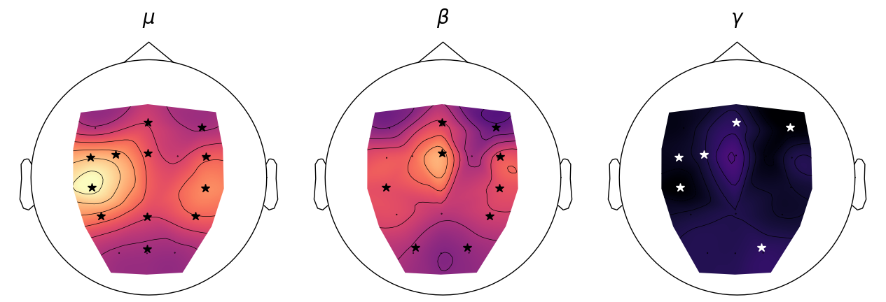
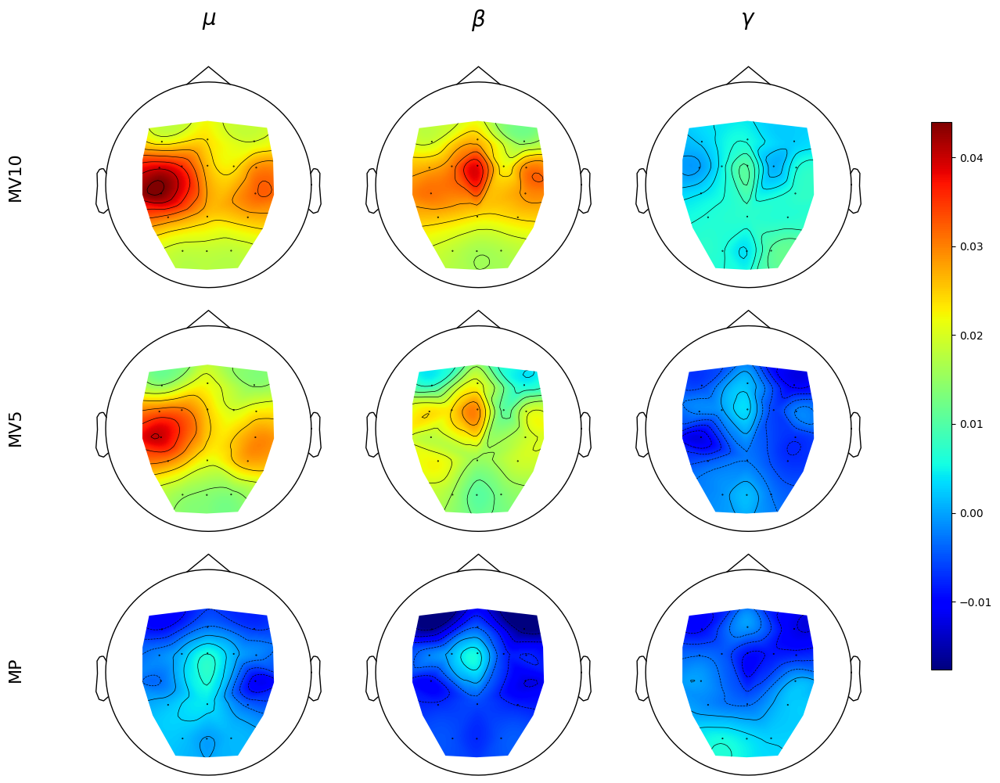
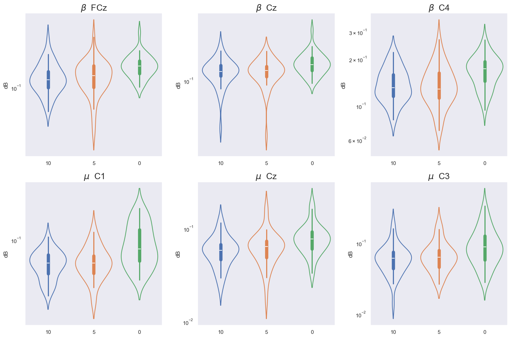

# Power Analysis

## Diferentes Rest and Activity

Shows the difference between the average power of rest periods and activity periods in the three types of movement (MA, MA, MA). This is the subtraction of the averages of rest and activity in the different exercises, meaning that the lowest value corresponds to the channels or bands whose average power is similar to the power at rest. This difference highlights the channels with the greatest difference between activity and rest. In the same figure, the names of the channels shown correspond to those that obtained a statistically significant difference (p <0.01) between the samples of activity and rest periods in more than 85% of the records.

## Power Distribution on every excercise

The difference between rest and activity in the three movements was evaluated, where differences in amplitude and spatial distribution of powers between the movements can be noted. A trend of powers resembling rest in MA can be observed, as well as a movement of the distribution towards the central areas in the three bands. The powers in γ are similar between the three movements, and these powers also resemble the powers of this same band at rest. In the BPts with significant differences (Figure 3), we can observe that the resting powers of the cerebral cortex are greater than during movement. Regarding the intentional movements MI10 and MI5, a similar power distribution in the cortex can be seen, especially in the μ and β bands. In μ, the greatest differences compared to rest are concentrated in the contralateral part of the cortex (C3, CP3, C1), while in β, the differences are concentrated in Cz for the MI5 movement, and in Cz and C4 for the MI10 movement, which is consistent with the previously mentioned significant differences.

## Differences between movements

Taking into account the channels with significant differences between rest and activity, ANOVA tests were performed between the different types of movement in these same channels. The significant differences (p <0.01) resulting from the ANOVA test are presented in the violin plots. These plots show the value distributions of the activity segments corresponding to the movements, highlighting the powers in channels and bands with statistically significant differences between the three groups of movement. Most of these channels are located in the motor area of the cerebral cortex.

