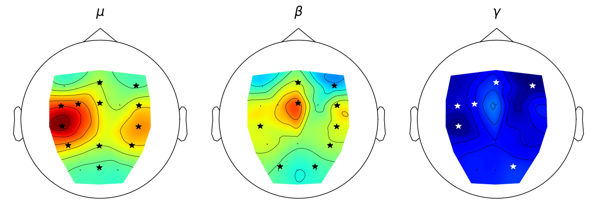

# EEG-SelfExecuted-Assisted-Movements

This repository contains all the files used for processing and analyzing various signals recorded during right knee flexion and extension exercises. The study includes three exercise variations with different torque levels.

## Overview
Participants performed the exercises under three different conditions:

1. Self-Executed Movements:

    * 10% Torque (\diez): Participants performed the movements with 10% of their maximum torque for both extension and flexion.
    * 5% Torque (\cinco): Participants performed the movements with 5% of their maximum torque.
3. Assisted Movement (\pasivo):

    * The machine executed the motion entirely, with no voluntary effort from the participants.

Before the exercises, each participant performed an isometric contraction on a torquemeter to determine their maximum torque for both knee extension and flexion. During all exercises, participants faced a mirror to maintain visual feedback.

## Protocol
Each participant completed three sessions, performing the three described exercises under the following protocol:

* Duration:
    * 20 seconds of rest followed by 40 seconds of exercise.
    * Each exercise was repeated for 4 to 6 cycles.

* Auditory Cues: Used to signal the start and end of active and rest periods.

Note: One participant was excluded from the study due to the inability to complete the final session.

 


For the data preparation install on a new enviroment:

```bash
cond create -n myenv python=3.11
pip install git+https://github.com/FernandoMoralesM01/iberoSignalPro

